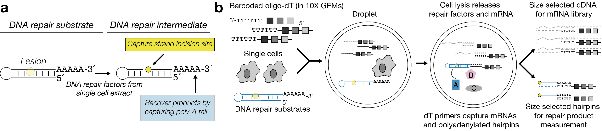

```{r setup, include=FALSE}
knitr::opts_chunk$set(echo = TRUE,
                      message = F,
                      warning = F)
source("scripts/functions.R")
library(ggpmisc)
```

We developed an approach to simultaneously measure biochemical activities and mRNA abundance in single cells. We've modified the existing 10x Genomics 3´-gene expression kit (v2) to measure DNA repair activities in single cells by including DNA repair substrates in single-cell mRNA sequencing experiment.



Following GEM generation and reverse transcription, we isolate the DNA repair fragments from the mRNA by size separation. We then prepare a single-cell repair library that captures DNA repair intermediates and products. 

<center>


</center>

## Processing raw data

Following sequencing, the mRNA fastq files are processed using the 10x Genomics [cellranger](https://support.10xgenomics.com/single-cell-gene-expression/software/pipelines/latest/what-is-cell-ranger) pipeline.

```{bash, eval = F}
transcriptome="path/to/refdata-cellranger-GRC38-3.0.0"

 cellranger count \
     --id="sample_mrna" \
     --fastqs="path/to/fastqs/" \
     --sample="sample" \
     --localcores=16 \
     --localmem=35 \
     --transcriptome=$transcriptome
```

The DNA repair libraries are processed using custom snakemake pipeline available [here](https://github.com/hesselberthlab/sc-haircut/tree/master/pipeline/haircut_pipeline). This pipeline produces a tsv with the following columns: 

- gene: concatenation of the substrate and the 5´ end alignment position
- cell: cell barcode sequence
- count: number of UMI counts for the gene and cell

This file contains all known 10x cell barcodes present in the fastq files. To make filtered matrices to use with sc-RNA seq R packages like [Seurat](https://satijalab.org/seurat/), we used the following functions from our analysis package [scrunchy](https://scrunchy.hesselberthlab.org/). 

```{r filter_matrix, eval = F}
#Convert UMI-tools output to matrix format
umitools_to_mtx(count_file = "path/to/count.tsv",
                output_path = "path/to/mtx/")
        
# Filter repair matrix for cell barcodes from cellranger 3.0.0 output
# barcodes.tsv file is present the output from cellranger
# outs/filtered_feature_bc_matrix/

filter_matrix(matrix_path = "path/to/mtx",
              barcodes_path = "path/to/cell/barcodes.tsv",
              output_path = "path/to/filtered_mtx")
```

The mRNA matrices from cellranger and the DNA repair matrices can be analyzed further using most multimodal sc-RNA-seq software. 

## Functional barnyard experiment

#### Barnyard plot

The Seurat object used in these plots was created [here](https://github.com/hesselberthlab/sc-haircut/blob/master/scripts/barnyard_data_init.R)
```{r classifycells}
load("../data/barnyard/barnyard.seurat.object.Rdata")

#Getting hairpin info from seurat object

df <- rownames_to_column(as.data.frame(t(as.matrix(GetAssayData(barnyard_seurat, assay = 'repair', slot = 'counts')))), "cell_id") %>%
        gather(hairpin_pos, count, -cell_id) %>%
        separate(hairpin_pos, into = c("hairpin", "position")) %>%
        mutate(position = as.double(position),
               count = as.double(count))

# Add repair positions based on average signal
repair_position = data_frame(hairpin = c('Uracil2', 'riboG2'),
                             repair_position = c(45, 44))

df %>% left_join(repair_position) %>%
        filter(position == repair_position) -> rt

# Get cutoffs to determine cell type by repair
# Cutoff is > 5% of the maximum signal for each substrate
rt %>% group_by(hairpin, position) %>%
        summarize(max_count = max(count)) %>%
        mutate(cut_off = round(max_count * .05)) -> cutoffs

# Define ribo cutoff and uracil cutoff
r = cutoffs$cut_off[1]
u = cutoffs$cut_off[2]

# Define cell types:
# UNGKO = >5% maximum singal on ribo substrate and < 5% of the max on uracil substrate
# RNASEH2CKO = >5% maximum singal on uracil substrate and < 5% of the max on ribo substrate
# Both = >5% maximum singal on ribo substrate and >5% of the max on uracil substrate
# Low signal = <5% maximum singal on ribo substrate and <5% of the max on uracil substrate

rt %>% select(-position, -repair_position) %>% 
        spread(hairpin, count) %>%
        mutate(color = if_else(riboG2 >= r & Uracil2 <+ u, 'UNGKO',
                               if_else(Uracil2 >= u & riboG2 <= r, 'RNASEH2KO',
                                       if_else(riboG2 >= r & Uracil2 >= u, 'Both',
                                               'Low signal')))) %>% 
        select(-riboG2, -Uracil2) -> color_df

df <- left_join(df, color_df) %>%
        left_join(repair_position)

# count number of cells in each category
df %>% filter(hairpin == "Uracil2", 
                          position == 1) %>%
        group_by(color) %>%
        summarise(total = n()) %>%
        ungroup() %>%
        rename('Cell Type' = color)-> table

# Make barnyard plot
df %>% filter(position == repair_position) %>%
        select(cell_id, hairpin, color, count) %>%
        spread(hairpin, count) %>% 
        ggplot(aes(x = Uracil2, y = riboG2, color = color)) + 
        geom_count(alpha = .7) +
        theme_cowplot() + 
        theme(legend.position= "top",
              legend.title = element_blank()) +
        scale_color_manual(values = c(colors[1], "#999999", colors[2:3])) + 
        xlab("Counts at uracil repair site") + 
        ylab("Counts at ribonucleotide repair site") + 
        annotate(geom = "table", x = 75, y = 40, label = list(table), 
                 vjust = .5, hjust = 0)
```

```{r saveTable, include=FALSE,eval=F}
#Save table for downstream use
df %>% select(cell_id, color) %>% distinct() %>%
        write_tsv("../data/barnyard/celltypes_by_repair.tsv")
```

#### Bulk coverage

```{r bulk plots, fig.height = 6, fig.width = 3, fig.align = "center"}
# Add celltype to seurat object
barnyard_seurat$cell_id_from_repair <- color_df$color 
barnyard_seurat$celltype <- barnyard_seurat$cell_id_from_repair

# Get average hairpin coverage by cell type above defined by repair
bulk_df = get_hairpin_coverage(barnyard_seurat) %>%
        mutate(count_1000 = count/1000)

# Make coverage plots
bulk_df %>% filter(hairpin == "Uracil2",
                   celltype %in% c("RNASEH2KO", "UNGKO"),
                   position > 33) %>%
        haircut_plot(., x= "position", y = "count_1000", col = "celltype",
                         xlim = c(34,61), point = T,
                         y_lab = "Total counts (10\u00B3)",
                         pal = colors[2:3]) + theme_cowplot() + 
        theme(legend.position= "top",
              legend.title = element_blank()) + 
        ggtitle("Uracil") -> p1


bulk_df %>% filter(hairpin == "riboG2",
                   celltype %in% c("RNASEH2KO", "UNGKO"),
                   position > 33) %>%
        haircut_plot(., x= "position", y = "count_1000", col = "celltype",
                         xlim = c(34,61), point = T,
                         y_lab = "Total counts (10\u00B3)",
                         pal = colors[2:3]) + theme_cowplot() + 
        theme(legend.position= "top",
              legend.title = element_blank()) + 
        ggtitle("Ribonucleotide") -> p2

plot_grid(p1, p2, nrow = 2)
```

#### mRNA expression vs DNA repair

```{r}
# Plot mRNA and repair coverage on UMAP plot using seurat functions

FeaturePlot(object = barnyard_seurat, features = c("repair_Uracil2-45", "repair_riboG2-44",
                                                   "UNG", "RNASEH2C"), 
            reduction = 'umap', cols = loupe_palette, order = T)

```

## Measuring DNA repair in PBMCs

#### Identifying cell types from expression data

The seurat object used below was created [here](https://github.com/hesselberthlab/sc-haircut/blob/master/scripts/pbmc_data_inti.R).

```{r umappbmc}
# Load PBMC seurat object
load("../data/pbmc/seurat/pbmc1.seurat.Rdata")

# Filter out platelets from data
pbmc1 <- subset(pbmc1, subset = celltype != "Platelet")

# Plot UMAP colored by cell type
DimPlot(pbmc1, reduction = 'umap', group.by = 'celltype', cols = colors)

```

#### Measuring DNA repair in PBMC cell types

```{r bulkplots_pbmc}
# Get hairpin coverage by cell type
df <- get_hairpin_coverage(pbmc1)

# add adduction position for plotting and filter out platelets
df %>% mutate(adduct_position1 = 44,
               adduct_position2 = -1) %>%
        filter(celltype != "Platelet") -> df

# Make coverage plots
df %>%
        filter(hairpin == 'Uracil',
               position > 34) %>%
        haircut_plot(., x = "position", y = "avg_count", point = TRUE,
                     xlim = c(35, 55), pal = colors, col = 'celltype', 
                     y_lab = "Average counts per cell") + 
        theme(legend.position = 'top') + 
        ggtitle("U:A repair")

df %>%
        filter(hairpin == 'GU',
               position > 34) %>%
        haircut_plot(., x = "position", y = "avg_count", point = TRUE,
                     xlim = c(35, 55), pal = colors, col = 'celltype', 
                     y_lab = "Average counts per cell") + 
        theme(legend.position = 'top') + 
        ggtitle("U:G repair")

df %>%
        filter(hairpin == 'riboG',
               position > 34) %>%
        haircut_plot(., x = "position", y = "avg_count", point = TRUE,
                     xlim = c(35, 55), pal = colors, col = 'celltype', 
                     y_lab = "Average counts per cell") + 
        theme(legend.position = 'top') + 
        ggtitle("Ribonucleotide repair")

df %>%
        filter(hairpin == 'Abasic',
               position > 34) %>%
        haircut_plot(., x = "position", y = "avg_count", point = TRUE,
                     xlim = c(35, 55), pal = colors, col = 'celltype', 
                     y_lab = "Average counts per cell") + 
        theme(legend.position = 'top') + 
        ggtitle("Abasic repair")

df %>%
        filter(hairpin == 'Normal',
               position > 34) %>%
        haircut_plot(., x = "position", y = "avg_count", point = TRUE,
                     xlim = c(35, 55), pal = colors, col = 'celltype', 
                     y_lab = "Average counts per cell") + 
        theme(legend.position = 'top') + 
        ggtitle("Unmodified substrate")

```

#### Single cell DNA repair in PBMCs

```{r singlecell_repair_PBMC, fig.height = 8, fig.width = 5, fig.align = "center"}
# Get dataframe of repair position activity values, cell ids, 
# and cell types from seurat object
repair.positions = c("Uracil-45", 
                     "riboG-44", 
                     "GU-45", 
                     "Abasic-46", 
                     "Abasic-45", 
                     "Normal-45")
df <- get_single_cell_df(pbmc1, feat = c(repair.positions, "celltype"))

#Make tidy data
df %>% gather(repair, activity, -celltype, -cell_id) -> df

#Add labels for plotting
repair_labels = tribble(~repair, ~label,
                        "Uracil_45", "U:A repair",
                        "GU_45", "U:G repair",
                        "riboG_44", "Ribonucelotide repair",
                        "Abasic_46", "Abasic repair long-patch",
                        "Abasic_45", "Abasic repair short-patch",
                        "Normal_45", "Unmodified substrate"
                        )

# Put samples in correct order
df %>% full_join(repair_labels) %>%        
        mutate(label = fct_relevel(label, "U:A repair", 
                                   "U:G repair", 
                                   "Ribonucelotide repair", 
                                   "Abasic repair long-patch",
                                   "Abasic repair short-patch",
                                   "Unmodified substrate")) -> df

# Plot activities 
df %>% filter(repair %in% c("Uracil_45", "GU_45", "riboG_44", "Normal_45")) %>%
        activity_plot() + 
        facet_wrap(~label, ncol = 1, strip.position = "left") 
```

```{r single-cell-repair-abasic}
df %>% filter(repair %in% c("Abasic_45", "Abasic_46")) %>%
        activity_plot(lab = label) 
```