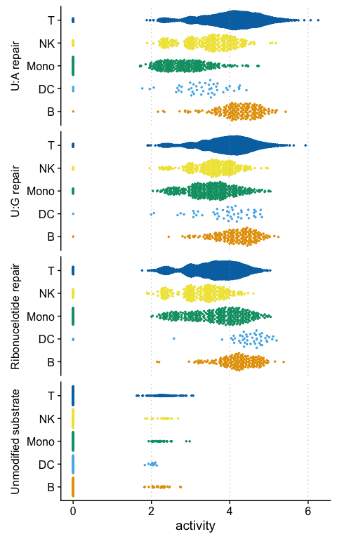

Heterogeneity of biochemical phenotypes and gene expression among single
cells
================

## Functional barnyard experiment

#### Barnyard plot

``` r
load("../data/barnyard/barnyard.seurat.object.Rdata")

#Getting hairpin info from seurat object

df <- rownames_to_column(as.data.frame(t(as.matrix(GetAssayData(barnyard_seurat, assay = 'repair', slot = 'counts')))), "cell_id") %>%
        gather(hairpin_pos, count, -cell_id) %>%
        separate(hairpin_pos, into = c("hairpin", "position")) %>%
        mutate(position = as.double(position),
               count = as.double(count))


repair_position = data_frame(hairpin = c('Uracil', 'riboG'),
                             repair_position = c(45, 44))

df %>% left_join(repair_position) %>%
        filter(position == repair_position) -> rt

rt %>% group_by(hairpin, position) %>%
        summarize(max_count = max(count)) %>%
        mutate(cut_off = round(max_count * .05)) -> cutoffs

r = cutoffs$cut_off[1]
u = cutoffs$cut_off[2]

rt %>% select(-position, -repair_position) %>% 
        spread(hairpin, count) %>%
        mutate(color = if_else(riboG >= r & Uracil <+ u, 'UNGKO',
                               if_else(Uracil >= u & riboG <= r, 'RNASEH2KO',
                                       if_else(riboG >= r & Uracil >= u, 'Both',
                                               'Low signal')))) %>% 
        select(-riboG, -Uracil) -> color_df

df <- left_join(df, color_df) %>%
        left_join(repair_position)

df %>% filter(hairpin == "Uracil", 
                          position == 1) %>%
        group_by(color) %>%
        summarise(total = n()) %>%
        ungroup() %>%
        rename('Cell Type' = color)-> table

repair_position = tribble(~hairpin, ~repair_position,
                          "Uracil", 45,
                          "riboG", 44)

df %>% filter(position == repair_position) %>%
        select(cell_id, hairpin, color, count) %>%
        spread(hairpin, count) %>% 
        ggplot(aes(x = Uracil, y = riboG, color = color)) + 
        geom_count(alpha = .7) +
        theme_cowplot() + 
        theme(legend.position= "top",
              legend.title = element_blank()) +
        scale_color_manual(values = c(colors[1], "#999999", colors[2:3])) + 
        xlab("Counts at uracil repair site") + 
        ylab("Counts at ribonucleotide repair site") + 
        annotate(geom = "table", x = 75, y = 40, label = list(table), 
                 vjust = .5, hjust = 0)
```

<!-- -->

#### Bulk coverage

``` r
barnyard_seurat$cell_id_from_repair <- color_df$color 
barnyard_seurat$celltype <- barnyard_seurat$cell_id_from_repair
bulk_df = get_hairpin_coverage(barnyard_seurat) %>%
        mutate(count_1000 = count/1000)

bulk_df %>% filter(hairpin == "Uracil",
                   celltype %in% c("RNASEH2KO", "UNGKO"),
                   position > 33) %>%
        haircut_plot(., x= "position", y = "count_1000", col = "celltype",
                         xlim = c(34,61), point = T,
                         y_lab = "Total counts (10\u00B3)",
                         pal = colors[2:3]) + theme_cowplot() + 
        theme(legend.position= "top",
              legend.title = element_blank()) + 
        ggtitle("Uracil") -> p1


bulk_df %>% filter(hairpin == "riboG",
                   celltype %in% c("RNASEH2KO", "UNGKO"),
                   position > 33) %>%
        haircut_plot(., x= "position", y = "count_1000", col = "celltype",
                         xlim = c(34,61), point = T,
                         y_lab = "Total counts (10\u00B3)",
                         pal = colors[2:3]) + theme_cowplot() + 
        theme(legend.position= "top",
              legend.title = element_blank()) + 
        ggtitle("Ribonucleotide") -> p2

plot_grid(p1, p2)
```

<!-- -->

#### mRNA expression vs DNA repair

``` r
FeaturePlot(object = barnyard_seurat, features = c("repair_Uracil-45", "repair_riboG-44",
                                                   "UNG", "RNASEH2C"), 
            reduction = 'umap', cols = loupe_palette)
```

<!-- -->

## Measuring DNA repair in PBMCs

#### Identifying cell types from expresion data

``` r
load("../data/pbmc/seurat/pbmc1.seurat.Rdata")

# Filter out platelets from data
pbmc1 <- subset(pbmc1, subset = celltype != "Platelet")
DimPlot(pbmc1, reduction = 'umap', group.by = 'celltype', cols = colors)
```

<!-- -->

#### Measuring DNA repair in PBMC cell types

``` r
df <- get_hairpin_coverage(pbmc1)

df %>% mutate(adduct_position1 = 44,
               adduct_position2 = -1) %>%
        filter(celltype != "Platelet") -> df

df %>%
        filter(hairpin == 'Uracil',
               position > 34) %>%
        haircut_plot(., x = "position", y = "avg_count", point = TRUE,
                     xlim = c(35, 55), pal = colors, col = 'celltype', 
                     y_lab = "Average counts per cell") + 
        theme(legend.position = 'top') + 
        ggtitle("A:U repair")
```

<!-- -->

``` r
df %>%
        filter(hairpin == 'GU',
               position > 34) %>%
        haircut_plot(., x = "position", y = "avg_count", point = TRUE,
                     xlim = c(35, 55), pal = colors, col = 'celltype', 
                     y_lab = "Average counts per cell") + 
        theme(legend.position = 'top') + 
        ggtitle("G:U repair")
```

<!-- -->

``` r
df %>%
        filter(hairpin == 'riboG',
               position > 34) %>%
        haircut_plot(., x = "position", y = "avg_count", point = TRUE,
                     xlim = c(35, 55), pal = colors, col = 'celltype', 
                     y_lab = "Average counts per cell") + 
        theme(legend.position = 'top') + 
        ggtitle("Ribonucleotide repair")
```

<!-- -->

``` r
df %>%
        filter(hairpin == 'Abasic',
               position > 34) %>%
        haircut_plot(., x = "position", y = "avg_count", point = TRUE,
                     xlim = c(35, 55), pal = colors, col = 'celltype', 
                     y_lab = "Average counts per cell") + 
        theme(legend.position = 'top') + 
        ggtitle("Abasic repair")
```

<!-- -->

``` r
df %>%
        filter(hairpin == 'Normal',
               position > 34) %>%
        haircut_plot(., x = "position", y = "avg_count", point = TRUE,
                     xlim = c(35, 55), pal = colors, col = 'celltype', 
                     y_lab = "Average counts per cell") + 
        theme(legend.position = 'top') + 
        ggtitle("Normal substrate")
```

<!-- -->

#### Single cell DNA repair in PBMCs

``` r
repair.positions = c("Uracil-45", 
                     "riboG-44", 
                     "GU-45", 
                     "Abasic-46", 
                     "Abasic-45", 
                     "Normal-45")
df <- get_single_cell_df(pbmc1, feat = c(repair.positions, "celltype"))

#Make tidy data
df %>% gather(repair, activity, -celltype, -cell_id) -> df

#Add labels for plotting
repair_labels = tribble(~repair, ~label,
                        "Uracil_45", "A:U repair",
                        "GU_45", "G:U repair",
                        "riboG_44", "Ribonucelotide repair",
                        "Abasic_46", "Abasic repair long-patch",
                        "Abasic_45", "Abasic repair short-patch",
                        "Normal_45", "Normal substrate"
                        )

# Put samples in correct order
df %>% full_join(repair_labels) %>%        
        mutate(label = fct_relevel(label, "A:U repair", 
                                   "G:U repair", 
                                   "Ribonucelotide repair", 
                                   "Abasic repair long-patch",
                                   "Abasic repair short-patch",
                                   "Normal substrate")) -> df

df %>% filter(repair %in% c("Uracil_45", "GU_45", "riboG_44", "Normal_45")) %>%
        activity_plot() + 
        facet_wrap(~label, ncol = 1, strip.position = "left") 
```

<!-- -->

``` r
df %>% filter(repair %in% c("Abasic_45", "Abasic_46")) %>%
        activity_plot(lab = label)
```

<!-- -->
