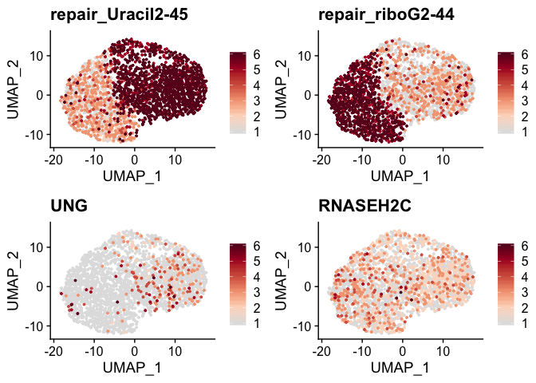
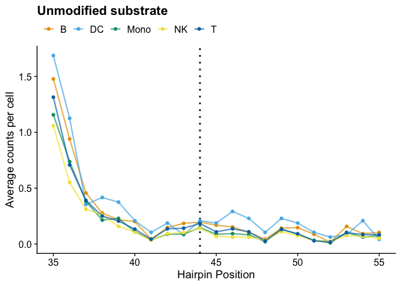

Heterogeneity of biochemical phenotypes and gene expression among single
cells
================

We developed an approach to simultaneously measure biochemical
activities and mRNA abundance in single cells. We’ve modified the
existing 10x Genomics 3´-gene expression kit (v2) to measure DNA repair
activities in single cells by including DNA repair substrates in
single-cell mRNA sequencing experiment.


Following GEM generation and reverse transcription, we isolate the DNA
repair fragments from the mRNA by size separation. We then prepare a
single-cell repair library that captures DNA repair intermediates and
products.

<center>


</center>

## Processing raw data

Following sequencing, the mRNA fastq files are processed using the 10x
Genomics
[cellranger](https://support.10xgenomics.com/single-cell-gene-expression/software/pipelines/latest/what-is-cell-ranger)
pipeline.

``` bash
transcriptome="path/to/refdata-cellranger-GRC38-3.0.0"

 cellranger count \
     --id="sample_mrna" \
     --fastqs="path/to/fastqs/" \
     --sample="sample" \
     --localcores=16 \
     --localmem=35 \
     --transcriptome=$transcriptome
```

The DNA repair libraries are processed using custom snakemake pipeline
available
[here](https://github.com/hesselberthlab/sc-haircut/tree/master/pipeline/haircut_pipeline).
This pipeline produces a tsv with the following columns:

  - gene: concatenation of the substrate and the 5´ end alignment
    position
  - cell: cell barcode sequence
  - count: number of UMI counts for the gene and cell

This file contains all known 10x cell barcodes present in the fastq
files. To make filtered matrices to use with sc-RNA seq R packages like
[Seurat](https://satijalab.org/seurat/), we used the following functions
from our analysis package
[scrunchy](https://scrunchy.hesselberthlab.org/).

``` r
#Convert UMI-tools output to matrix format
umitools_to_mtx(count_file = "path/to/count.tsv",
                output_path = "path/to/mtx/")
        
# Filter repair matrix for cell barcodes from cellranger 3.0.0 output
# barcodes.tsv file is present the output from cellranger
# outs/filtered_feature_bc_matrix/

filter_matrix(matrix_path = "path/to/mtx",
              barcodes_path = "path/to/cell/barcodes.tsv",
              output_path = "path/to/filtered_mtx")
```

The mRNA matrices from cellranger and the DNA repair matrices can be
analyzed further using most multimodal sc-RNA-seq software.

## Functional barnyard experiment

#### Barnyard plot

The Seurat object used in these plots was created
[here](https://github.com/hesselberthlab/sc-haircut/blob/master/scripts/barnyard_data_init.R)

``` r
load("../data/barnyard/barnyard.seurat.object.Rdata")

#Getting hairpin info from seurat object

df <- rownames_to_column(as.data.frame(t(as.matrix(GetAssayData(barnyard_seurat, assay = 'repair', slot = 'counts')))), "cell_id") %>%
        gather(hairpin_pos, count, -cell_id) %>%
        separate(hairpin_pos, into = c("hairpin", "position")) %>%
        mutate(position = as.double(position),
               count = as.double(count))

# Add repair positions based on average signal
repair_position = data_frame(hairpin = c('Uracil2', 'riboG2'),
                             repair_position = c(45, 44))

df %>% left_join(repair_position) %>%
        filter(position == repair_position) -> rt

# Get cutoffs to determine cell type by repair
# Cutoff is > 5% of the maximum signal for each substrate
rt %>% group_by(hairpin, position) %>%
        summarize(max_count = max(count)) %>%
        mutate(cut_off = round(max_count * .05)) -> cutoffs

# Define ribo cutoff and uracil cutoff
r = cutoffs$cut_off[1]
u = cutoffs$cut_off[2]

# Define cell types:
# UNGKO = >5% maximum singal on ribo substrate and < 5% of the max on uracil substrate
# RNASEH2CKO = >5% maximum singal on uracil substrate and < 5% of the max on ribo substrate
# Both = >5% maximum singal on ribo substrate and >5% of the max on uracil substrate
# Low signal = <5% maximum singal on ribo substrate and <5% of the max on uracil substrate

rt %>% select(-position, -repair_position) %>% 
        spread(hairpin, count) %>%
        mutate(color = if_else(riboG2 >= r & Uracil2 <+ u, 'UNGKO',
                               if_else(Uracil2 >= u & riboG2 <= r, 'RNASEH2KO',
                                       if_else(riboG2 >= r & Uracil2 >= u, 'Both',
                                               'Low signal')))) %>% 
        select(-riboG2, -Uracil2) -> color_df

df <- left_join(df, color_df) %>%
        left_join(repair_position)

# count number of cells in each category
df %>% filter(hairpin == "Uracil2", 
                          position == 1) %>%
        group_by(color) %>%
        summarise(total = n()) %>%
        ungroup() %>%
        rename('Cell Type' = color)-> table

# Make barnyard plot
df %>% filter(position == repair_position) %>%
        select(cell_id, hairpin, color, count) %>%
        spread(hairpin, count) %>% 
        ggplot(aes(x = Uracil2, y = riboG2, color = color)) + 
        geom_count(alpha = .7) +
        theme_cowplot() + 
        theme(legend.position= "top",
              legend.title = element_blank()) +
        scale_color_manual(values = c(colors[1], "#999999", colors[2:3])) + 
        xlab("Counts at uracil repair site") + 
        ylab("Counts at ribonucleotide repair site") + 
        annotate(geom = "table", x = 75, y = 40, label = list(table), 
                 vjust = .5, hjust = 0)
```

<!-- -->

#### Bulk coverage

``` r
# Add celltype to seurat object
barnyard_seurat$cell_id_from_repair <- color_df$color 
barnyard_seurat$celltype <- barnyard_seurat$cell_id_from_repair

# Get average hairpin coverage by cell type above defined by repair
bulk_df = get_hairpin_coverage(barnyard_seurat) %>%
        mutate(count_1000 = count/1000)

# Make coverage plots
bulk_df %>% filter(hairpin == "Uracil2",
                   celltype %in% c("RNASEH2KO", "UNGKO"),
                   position > 33) %>%
        haircut_plot(., x= "position", y = "count_1000", col = "celltype",
                         xlim = c(34,61), point = T,
                         y_lab = "Total counts (10\u00B3)",
                         pal = colors[2:3]) + theme_cowplot() + 
        theme(legend.position= "top",
              legend.title = element_blank()) + 
        ggtitle("Uracil") -> p1


bulk_df %>% filter(hairpin == "riboG2",
                   celltype %in% c("RNASEH2KO", "UNGKO"),
                   position > 33) %>%
        haircut_plot(., x= "position", y = "count_1000", col = "celltype",
                         xlim = c(34,61), point = T,
                         y_lab = "Total counts (10\u00B3)",
                         pal = colors[2:3]) + theme_cowplot() + 
        theme(legend.position= "top",
              legend.title = element_blank()) + 
        ggtitle("Ribonucleotide") -> p2

plot_grid(p1, p2, nrow = 2)
```


#### mRNA expression vs DNA repair

``` r
# Plot mRNA and repair coverage on UMAP plot using seurat functions

FeaturePlot(object = barnyard_seurat, features = c("repair_Uracil2-45", "repair_riboG2-44",
                                                   "UNG", "RNASEH2C"), 
            reduction = 'umap', cols = loupe_palette, order = T)
```

<!-- -->

## Measuring DNA repair in PBMCs

#### Identifying cell types from expression data

The seurat object used below was created
[here](https://github.com/hesselberthlab/sc-haircut/blob/master/scripts/pbmc_data_inti.R).

``` r
# Load PBMC seurat object
load("../data/pbmc/seurat/pbmc1.seurat.Rdata")

# Filter out platelets from data
pbmc1 <- subset(pbmc1, subset = celltype != "Platelet")

# Plot UMAP colored by cell type
DimPlot(pbmc1, reduction = 'umap', group.by = 'celltype', cols = colors)
```

<!-- -->

#### Measuring DNA repair in PBMC cell types

``` r
# Get hairpin coverage by cell type
df <- get_hairpin_coverage(pbmc1)

# add adduction position for plotting and filter out platelets
df %>% mutate(adduct_position1 = 44,
               adduct_position2 = -1) %>%
        filter(celltype != "Platelet") -> df

# Make coverage plots
df %>%
        filter(hairpin == 'Uracil',
               position > 34) %>%
        haircut_plot(., x = "position", y = "avg_count", point = TRUE,
                     xlim = c(35, 55), pal = colors, col = 'celltype', 
                     y_lab = "Average counts per cell") + 
        theme(legend.position = 'top') + 
        ggtitle("U:A repair")
```

<!-- -->

``` r
df %>%
        filter(hairpin == 'GU',
               position > 34) %>%
        haircut_plot(., x = "position", y = "avg_count", point = TRUE,
                     xlim = c(35, 55), pal = colors, col = 'celltype', 
                     y_lab = "Average counts per cell") + 
        theme(legend.position = 'top') + 
        ggtitle("U:G repair")
```

<!-- -->

``` r
df %>%
        filter(hairpin == 'riboG',
               position > 34) %>%
        haircut_plot(., x = "position", y = "avg_count", point = TRUE,
                     xlim = c(35, 55), pal = colors, col = 'celltype', 
                     y_lab = "Average counts per cell") + 
        theme(legend.position = 'top') + 
        ggtitle("Ribonucleotide repair")
```

<!-- -->

``` r
df %>%
        filter(hairpin == 'Abasic',
               position > 34) %>%
        haircut_plot(., x = "position", y = "avg_count", point = TRUE,
                     xlim = c(35, 55), pal = colors, col = 'celltype', 
                     y_lab = "Average counts per cell") + 
        theme(legend.position = 'top') + 
        ggtitle("Abasic repair")
```

<!-- -->

``` r
df %>%
        filter(hairpin == 'Normal',
               position > 34) %>%
        haircut_plot(., x = "position", y = "avg_count", point = TRUE,
                     xlim = c(35, 55), pal = colors, col = 'celltype', 
                     y_lab = "Average counts per cell") + 
        theme(legend.position = 'top') + 
        ggtitle("Unmodified substrate")
```

<!-- -->

#### Single cell DNA repair in PBMCs

``` r
# Get dataframe of repair position activity values, cell ids, 
# and cell types from seurat object
repair.positions = c("Uracil-45", 
                     "riboG-44", 
                     "GU-45", 
                     "Abasic-46", 
                     "Abasic-45", 
                     "Normal-45")
df <- get_single_cell_df(pbmc1, feat = c(repair.positions, "celltype"))

#Make tidy data
df %>% gather(repair, activity, -celltype, -cell_id) -> df

#Add labels for plotting
repair_labels = tribble(~repair, ~label,
                        "Uracil_45", "U:A repair",
                        "GU_45", "U:G repair",
                        "riboG_44", "Ribonucelotide repair",
                        "Abasic_46", "Abasic repair long-patch",
                        "Abasic_45", "Abasic repair short-patch",
                        "Normal_45", "Unmodified substrate"
                        )

# Put samples in correct order
df %>% full_join(repair_labels) %>%        
        mutate(label = fct_relevel(label, "U:A repair", 
                                   "U:G repair", 
                                   "Ribonucelotide repair", 
                                   "Abasic repair long-patch",
                                   "Abasic repair short-patch",
                                   "Unmodified substrate")) -> df

# Plot activities 
df %>% filter(repair %in% c("Uracil_45", "GU_45", "riboG_44", "Normal_45")) %>%
        activity_plot() + 
        facet_wrap(~label, ncol = 1, strip.position = "left") 
```


``` r
df %>% filter(repair %in% c("Abasic_45", "Abasic_46")) %>%
        activity_plot(lab = label) 
```

<!-- -->

# Session info

  - Typical install time for all packages: ~30 minutes
  - Expected run time for full data fastq files -\> expression matrices:
    ~6-24 hours
  - Expected run time for full data expression matrices -\> plots: ~10
    minutes
  - Demo expression matrices found in scrunchy R package.
  - No required non-standard hardware but platform LSF significantly
    reduces run time.

Software tested only on R version 3.5 using the following
    packages.

``` r
devtools::session_info()
```

    ## ─ Session info ──────────────────────────────────────────────────────────
    ##  setting  value                       
    ##  version  R version 3.5.1 (2018-07-02)
    ##  os       macOS High Sierra 10.13.6   
    ##  system   x86_64, darwin15.6.0        
    ##  ui       X11                         
    ##  language (EN)                        
    ##  collate  en_US.UTF-8                 
    ##  ctype    en_US.UTF-8                 
    ##  tz       America/Denver              
    ##  date     2019-11-12                  
    ## 
    ## ─ Packages ──────────────────────────────────────────────────────────────
    ##  package              * version    date       lib
    ##  ape                    5.3        2019-03-17 [1]
    ##  assertthat             0.2.1      2019-03-21 [1]
    ##  backports              1.1.4      2019-04-10 [1]
    ##  beeswarm               0.2.3      2016-04-25 [1]
    ##  bibtex                 0.4.2      2017-06-30 [1]
    ##  Biobase                2.42.0     2018-10-30 [1]
    ##  BiocGenerics           0.28.0     2018-10-30 [1]
    ##  BiocNeighbors          1.0.0      2018-10-30 [1]
    ##  BiocParallel           1.16.6     2019-02-17 [1]
    ##  bitops                 1.0-6      2013-08-17 [1]
    ##  broom                  0.5.2      2019-04-07 [1]
    ##  callr                  3.2.0      2019-03-15 [1]
    ##  caTools                1.17.1.2   2019-03-06 [1]
    ##  cellranger             1.1.0      2016-07-27 [1]
    ##  circlize               0.4.6      2019-04-03 [1]
    ##  cli                    1.1.0      2019-03-19 [1]
    ##  cluster                2.1.0      2019-06-19 [1]
    ##  codetools              0.2-16     2018-12-24 [1]
    ##  colorblindr          * 0.1.0      2019-05-09 [1]
    ##  colorspace           * 1.4-1      2019-03-18 [1]
    ##  ComplexHeatmap         1.20.0     2018-10-30 [1]
    ##  cowplot              * 0.9.99     2019-06-25 [1]
    ##  crayon                 1.3.4      2017-09-16 [1]
    ##  data.table             1.12.2     2019-04-07 [1]
    ##  DelayedArray           0.8.0      2018-10-30 [1]
    ##  DelayedMatrixStats     1.4.0      2018-10-30 [1]
    ##  desc                   1.2.0      2018-05-01 [1]
    ##  devtools               2.0.2      2019-04-08 [1]
    ##  digest                 0.6.20     2019-07-04 [1]
    ##  dplyr                * 0.8.3      2019-07-04 [1]
    ##  dynamicTreeCut         1.63-1     2016-03-11 [1]
    ##  edgeR                  3.24.3     2019-01-02 [1]
    ##  evaluate               0.14       2019-05-28 [1]
    ##  fitdistrplus           1.0-14     2019-01-23 [1]
    ##  forcats              * 0.4.0      2019-02-17 [1]
    ##  fs                     1.3.1      2019-05-06 [1]
    ##  future                 1.14.0     2019-07-02 [1]
    ##  future.apply           1.3.0      2019-06-18 [1]
    ##  gbRd                   0.4-11     2012-10-01 [1]
    ##  gdata                  2.18.0     2017-06-06 [1]
    ##  generics               0.0.2      2018-11-29 [1]
    ##  GenomeInfoDb           1.18.2     2019-02-12 [1]
    ##  GenomeInfoDbData       1.2.0      2018-12-19 [1]
    ##  GenomicRanges          1.34.0     2018-10-30 [1]
    ##  GetoptLong             0.1.7      2018-06-10 [1]
    ##  ggbeeswarm             0.6.0      2017-08-07 [1]
    ##  ggplot2              * 3.2.0      2019-06-16 [1]
    ##  ggpmisc              * 0.3.1      2019-04-02 [1]
    ##  ggrepel                0.8.1      2019-05-07 [1]
    ##  ggridges               0.5.1      2018-09-27 [1]
    ##  ggsignif               0.5.0      2019-02-20 [1]
    ##  GlobalOptions          0.1.0      2018-06-09 [1]
    ##  globals                0.12.4     2018-10-11 [1]
    ##  glue                   1.3.1      2019-03-12 [1]
    ##  gplots                 3.0.1.1    2019-01-27 [1]
    ##  gridExtra              2.3        2017-09-09 [1]
    ##  gtable                 0.3.0      2019-03-25 [1]
    ##  gtools                 3.8.1      2018-06-26 [1]
    ##  haven                  2.1.0      2019-02-19 [1]
    ##  HDF5Array              1.10.1     2018-12-05 [1]
    ##  hms                    0.4.2      2018-03-10 [1]
    ##  htmltools              0.3.6      2017-04-28 [1]
    ##  htmlwidgets            1.3        2018-09-30 [1]
    ##  httr                   1.4.0      2018-12-11 [1]
    ##  ica                    1.0-2      2018-05-24 [1]
    ##  igraph                 1.2.4.1    2019-04-22 [1]
    ##  IRanges                2.16.0     2018-10-30 [1]
    ##  irlba                  2.3.3      2019-02-05 [1]
    ##  jsonlite               1.6        2018-12-07 [1]
    ##  KernSmooth             2.23-15    2015-06-29 [1]
    ##  knitr                  1.23       2019-05-18 [1]
    ##  labeling               0.3        2014-08-23 [1]
    ##  lattice                0.20-38    2018-11-04 [1]
    ##  lazyeval               0.2.2      2019-03-15 [1]
    ##  limma                  3.38.3     2018-12-02 [1]
    ##  listenv                0.7.0      2018-01-21 [1]
    ##  lmtest                 0.9-37     2019-04-30 [1]
    ##  locfit                 1.5-9.1    2013-04-20 [1]
    ##  lsei                   1.2-0      2017-10-23 [1]
    ##  lubridate              1.7.4      2018-04-11 [1]
    ##  magrittr               1.5        2014-11-22 [1]
    ##  MASS                   7.3-51.4   2019-03-31 [1]
    ##  Matrix                 1.2-17     2019-03-22 [1]
    ##  matrixStats            0.54.0     2018-07-23 [1]
    ##  memoise                1.1.0      2017-04-21 [1]
    ##  metap                  1.1        2019-02-06 [1]
    ##  modelr                 0.1.4      2019-02-18 [1]
    ##  multcomp               1.4-10     2019-03-05 [1]
    ##  MultiAssayExperiment   1.8.3      2019-02-13 [1]
    ##  munsell                0.5.0      2018-06-12 [1]
    ##  mvtnorm                1.0-11     2019-06-19 [1]
    ##  nlme                   3.1-140    2019-05-12 [1]
    ##  npsurv                 0.4-0      2017-10-14 [1]
    ##  pbapply                1.4-0      2019-02-05 [1]
    ##  pillar                 1.4.2      2019-06-29 [1]
    ##  pkgbuild               1.0.3      2019-03-20 [1]
    ##  pkgconfig              2.0.2      2018-08-16 [1]
    ##  pkgload                1.0.2      2018-10-29 [1]
    ##  plotly                 4.9.0      2019-04-10 [1]
    ##  plyr                   1.8.4      2016-06-08 [1]
    ##  png                    0.1-7      2013-12-03 [1]
    ##  prettyunits            1.0.2      2015-07-13 [1]
    ##  processx               3.4.0      2019-07-03 [1]
    ##  ps                     1.3.0      2018-12-21 [1]
    ##  purrr                * 0.3.2      2019-03-15 [1]
    ##  qvalue                 2.14.1     2019-01-10 [1]
    ##  R.methodsS3            1.7.1      2016-02-16 [1]
    ##  R.oo                   1.22.0     2018-04-22 [1]
    ##  R.utils                2.9.0      2019-06-13 [1]
    ##  R6                     2.4.0      2019-02-14 [1]
    ##  RANN                   2.6.1      2019-01-08 [1]
    ##  RColorBrewer           1.1-2      2014-12-07 [1]
    ##  Rcpp                   1.0.2      2019-07-25 [1]
    ##  RCurl                  1.95-4.12  2019-03-04 [1]
    ##  Rdpack                 0.11-0     2019-04-14 [1]
    ##  readr                * 1.3.1      2018-12-21 [1]
    ##  readxl                 1.3.1      2019-03-13 [1]
    ##  remotes                2.1.0      2019-06-24 [1]
    ##  reshape2               1.4.3      2017-12-11 [1]
    ##  reticulate             1.12       2019-04-12 [1]
    ##  rhdf5                  2.26.2     2019-01-02 [1]
    ##  Rhdf5lib               1.4.3      2019-03-25 [1]
    ##  rjson                  0.2.20     2018-06-08 [1]
    ##  rlang                  0.4.0      2019-06-25 [1]
    ##  rmarkdown              1.13       2019-05-22 [1]
    ##  ROCR                   1.0-7      2015-03-26 [1]
    ##  rprojroot              1.3-2      2018-01-03 [1]
    ##  rstudioapi             0.10       2019-03-19 [1]
    ##  rsvd                   1.0.1      2019-06-02 [1]
    ##  Rtsne                  0.15       2018-11-10 [1]
    ##  rvest                  0.3.4      2019-05-15 [1]
    ##  S4Vectors              0.20.1     2018-11-09 [1]
    ##  sandwich               2.5-1      2019-04-06 [1]
    ##  scales                 1.0.0      2018-08-09 [1]
    ##  scater                 1.10.1     2019-01-04 [1]
    ##  scran                  1.10.2     2019-01-04 [1]
    ##  scrunchy             * 0.0.0.9000 2019-07-15 [1]
    ##  sctransform            0.2.0      2019-05-13 [1]
    ##  SDMTools               1.1-221.1  2019-04-18 [1]
    ##  sessioninfo            1.1.1      2018-11-05 [1]
    ##  Seurat               * 3.0.3.9004 2019-06-25 [1]
    ##  shape                  1.4.4      2018-02-07 [1]
    ##  SingleCellExperiment   1.4.1      2019-01-04 [1]
    ##  statmod                1.4.32     2019-05-29 [1]
    ##  stringi                1.4.3      2019-03-12 [1]
    ##  stringr              * 1.4.0      2019-02-10 [1]
    ##  SummarizedExperiment   1.12.0     2018-10-30 [1]
    ##  survival               2.44-1.1   2019-04-01 [1]
    ##  testthat               2.1.1      2019-04-23 [1]
    ##  TH.data                1.0-10     2019-01-21 [1]
    ##  tibble               * 2.1.3      2019-06-06 [1]
    ##  tidyr                * 0.8.3      2019-03-01 [1]
    ##  tidyselect             0.2.5      2018-10-11 [1]
    ##  tidyverse            * 1.2.1      2017-11-14 [1]
    ##  tsne                   0.1-3      2016-07-15 [1]
    ##  umap                   0.2.2.0    2019-05-13 [1]
    ##  usethis                1.5.0      2019-04-07 [1]
    ##  vipor                  0.4.5      2017-03-22 [1]
    ##  viridis                0.5.1      2018-03-29 [1]
    ##  viridisLite            0.3.0      2018-02-01 [1]
    ##  withr                  2.1.2      2018-03-15 [1]
    ##  xfun                   0.8        2019-06-25 [1]
    ##  xml2                   1.2.0      2018-01-24 [1]
    ##  XVector                0.22.0     2018-10-30 [1]
    ##  yaml                   2.2.0      2018-07-25 [1]
    ##  zlibbioc               1.28.0     2018-10-30 [1]
    ##  zoo                    1.8-6      2019-05-28 [1]
    ##  source                                  
    ##  CRAN (R 3.5.2)                          
    ##  CRAN (R 3.5.1)                          
    ##  CRAN (R 3.5.2)                          
    ##  CRAN (R 3.5.0)                          
    ##  CRAN (R 3.5.0)                          
    ##  Bioconductor                            
    ##  Bioconductor                            
    ##  Bioconductor                            
    ##  Bioconductor                            
    ##  CRAN (R 3.5.0)                          
    ##  CRAN (R 3.5.2)                          
    ##  CRAN (R 3.5.2)                          
    ##  CRAN (R 3.5.2)                          
    ##  CRAN (R 3.5.0)                          
    ##  CRAN (R 3.5.2)                          
    ##  CRAN (R 3.5.2)                          
    ##  CRAN (R 3.5.2)                          
    ##  CRAN (R 3.5.2)                          
    ##  Github (clauswilke/colorblindr@1ac3d4d) 
    ##  CRAN (R 3.5.2)                          
    ##  Bioconductor                            
    ##  Github (wilkelab/cowplot@57feb8e)       
    ##  CRAN (R 3.5.0)                          
    ##  CRAN (R 3.5.2)                          
    ##  Bioconductor                            
    ##  Bioconductor                            
    ##  CRAN (R 3.5.0)                          
    ##  CRAN (R 3.5.2)                          
    ##  CRAN (R 3.5.2)                          
    ##  CRAN (R 3.5.2)                          
    ##  CRAN (R 3.5.0)                          
    ##  Bioconductor                            
    ##  CRAN (R 3.5.2)                          
    ##  CRAN (R 3.5.2)                          
    ##  CRAN (R 3.5.2)                          
    ##  CRAN (R 3.5.2)                          
    ##  CRAN (R 3.5.1)                          
    ##  CRAN (R 3.5.2)                          
    ##  CRAN (R 3.5.0)                          
    ##  CRAN (R 3.5.0)                          
    ##  CRAN (R 3.5.0)                          
    ##  Bioconductor                            
    ##  Bioconductor                            
    ##  Bioconductor                            
    ##  CRAN (R 3.5.0)                          
    ##  CRAN (R 3.5.0)                          
    ##  CRAN (R 3.5.2)                          
    ##  CRAN (R 3.5.2)                          
    ##  CRAN (R 3.5.2)                          
    ##  CRAN (R 3.5.0)                          
    ##  CRAN (R 3.5.2)                          
    ##  CRAN (R 3.5.0)                          
    ##  CRAN (R 3.5.0)                          
    ##  CRAN (R 3.5.2)                          
    ##  CRAN (R 3.5.2)                          
    ##  CRAN (R 3.5.0)                          
    ##  CRAN (R 3.5.1)                          
    ##  CRAN (R 3.5.0)                          
    ##  CRAN (R 3.5.2)                          
    ##  Bioconductor                            
    ##  CRAN (R 3.5.0)                          
    ##  CRAN (R 3.5.0)                          
    ##  CRAN (R 3.5.0)                          
    ##  CRAN (R 3.5.0)                          
    ##  CRAN (R 3.5.0)                          
    ##  CRAN (R 3.5.2)                          
    ##  Bioconductor                            
    ##  CRAN (R 3.5.2)                          
    ##  CRAN (R 3.5.0)                          
    ##  CRAN (R 3.5.1)                          
    ##  CRAN (R 3.5.2)                          
    ##  CRAN (R 3.5.0)                          
    ##  CRAN (R 3.5.0)                          
    ##  CRAN (R 3.5.2)                          
    ##  Bioconductor                            
    ##  CRAN (R 3.5.0)                          
    ##  CRAN (R 3.5.2)                          
    ##  CRAN (R 3.5.0)                          
    ##  CRAN (R 3.5.0)                          
    ##  CRAN (R 3.5.0)                          
    ##  CRAN (R 3.5.0)                          
    ##  CRAN (R 3.5.2)                          
    ##  CRAN (R 3.5.2)                          
    ##  CRAN (R 3.5.0)                          
    ##  CRAN (R 3.5.0)                          
    ##  CRAN (R 3.5.2)                          
    ##  CRAN (R 3.5.2)                          
    ##  CRAN (R 3.5.2)                          
    ##  Bioconductor                            
    ##  CRAN (R 3.5.0)                          
    ##  CRAN (R 3.5.2)                          
    ##  CRAN (R 3.5.2)                          
    ##  CRAN (R 3.5.0)                          
    ##  CRAN (R 3.5.2)                          
    ##  CRAN (R 3.5.2)                          
    ##  CRAN (R 3.5.1)                          
    ##  CRAN (R 3.5.0)                          
    ##  CRAN (R 3.5.0)                          
    ##  CRAN (R 3.5.1)                          
    ##  CRAN (R 3.5.0)                          
    ##  CRAN (R 3.5.0)                          
    ##  CRAN (R 3.5.0)                          
    ##  CRAN (R 3.5.1)                          
    ##  CRAN (R 3.5.0)                          
    ##  CRAN (R 3.5.2)                          
    ##  Bioconductor                            
    ##  CRAN (R 3.5.0)                          
    ##  CRAN (R 3.5.0)                          
    ##  CRAN (R 3.5.2)                          
    ##  CRAN (R 3.5.2)                          
    ##  CRAN (R 3.5.2)                          
    ##  CRAN (R 3.5.0)                          
    ##  CRAN (R 3.5.2)                          
    ##  CRAN (R 3.5.2)                          
    ##  CRAN (R 3.5.2)                          
    ##  CRAN (R 3.5.0)                          
    ##  CRAN (R 3.5.2)                          
    ##  CRAN (R 3.5.2)                          
    ##  CRAN (R 3.5.0)                          
    ##  CRAN (R 3.5.2)                          
    ##  Bioconductor                            
    ##  Bioconductor                            
    ##  CRAN (R 3.5.0)                          
    ##  CRAN (R 3.5.2)                          
    ##  CRAN (R 3.5.2)                          
    ##  CRAN (R 3.5.0)                          
    ##  CRAN (R 3.5.0)                          
    ##  CRAN (R 3.5.1)                          
    ##  CRAN (R 3.5.2)                          
    ##  CRAN (R 3.5.0)                          
    ##  CRAN (R 3.5.2)                          
    ##  Bioconductor                            
    ##  CRAN (R 3.5.2)                          
    ##  CRAN (R 3.5.0)                          
    ##  Bioconductor                            
    ##  Bioconductor                            
    ##  Github (hesselberthlab/scrunchy@b2f8cea)
    ##  Github (ChristophH/sctransform@8e48f49) 
    ##  CRAN (R 3.5.2)                          
    ##  CRAN (R 3.5.0)                          
    ##  Github (satijalab/seurat@9a9f439)       
    ##  CRAN (R 3.5.0)                          
    ##  Bioconductor                            
    ##  CRAN (R 3.5.2)                          
    ##  CRAN (R 3.5.2)                          
    ##  CRAN (R 3.5.2)                          
    ##  Bioconductor                            
    ##  CRAN (R 3.5.2)                          
    ##  CRAN (R 3.5.2)                          
    ##  CRAN (R 3.5.2)                          
    ##  CRAN (R 3.5.2)                          
    ##  CRAN (R 3.5.2)                          
    ##  CRAN (R 3.5.0)                          
    ##  CRAN (R 3.5.0)                          
    ##  CRAN (R 3.5.0)                          
    ##  CRAN (R 3.5.1)                          
    ##  CRAN (R 3.5.2)                          
    ##  CRAN (R 3.5.0)                          
    ##  CRAN (R 3.5.0)                          
    ##  CRAN (R 3.5.0)                          
    ##  CRAN (R 3.5.0)                          
    ##  CRAN (R 3.5.2)                          
    ##  CRAN (R 3.5.0)                          
    ##  Bioconductor                            
    ##  CRAN (R 3.5.0)                          
    ##  Bioconductor                            
    ##  CRAN (R 3.5.2)                          
    ## 
    ## [1] /Library/Frameworks/R.framework/Versions/3.5/Resources/library

Additional software dependencies:

  - Python v3
  - Snakemake
  - cellranger v3.0.2
  - bedtools v2.26
  - samtools v1.9
  - bowtie2 v 2.3.2
  - umi\_tools from CGAT
  - cutadapt v1.16
